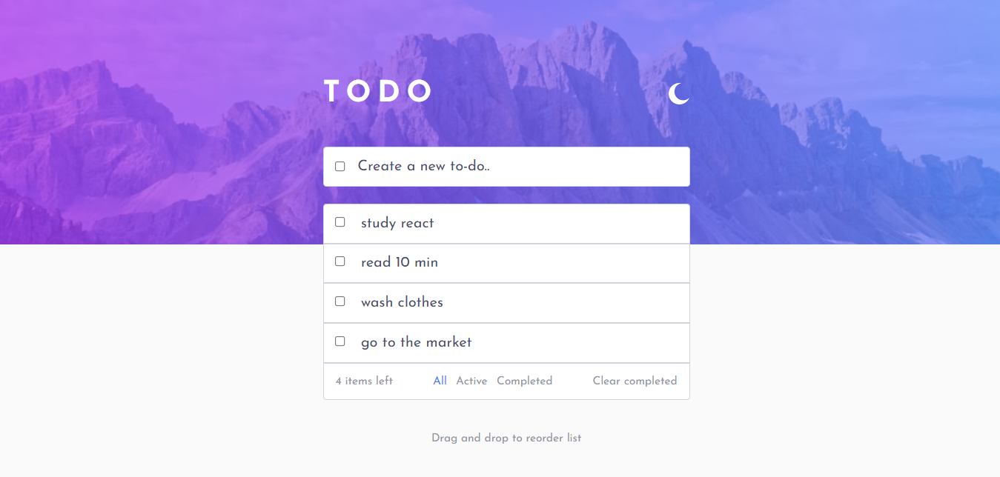
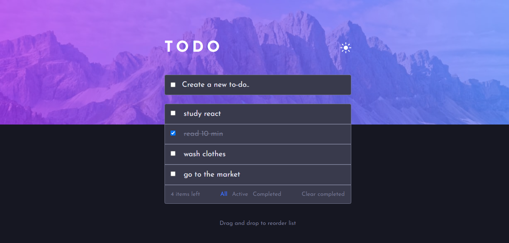
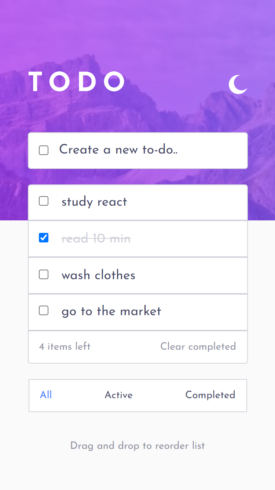
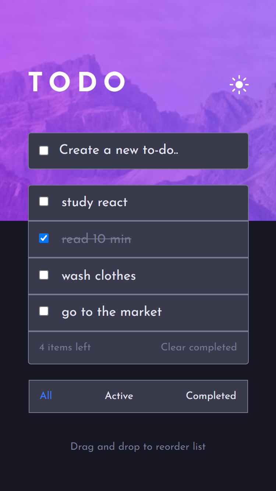

# Frontend Mentor - Todo app solution

This is a solution to the [Todo app challenge on Frontend Mentor](https://www.frontendmentor.io/challenges/todo-app-Su1_KokOW). 

## Table of contents

- [Overview](#overview)
  - [The challenge](#the-challenge)
  - [Screenshot](#screenshot)
- [My process](#my-process)
  - [Built with](#built-with)
  - [What I learned](#what-i-learned)
  
## Overview

### The challenge

Users should be able to:

- View the optimal layout for the app depending on their device's screen size
- Add new todos to the list
- Mark todos as complete
- Delete todos from the list
- Filter by all/active/complete todos
- Clear all completed todos
- Toggle light and dark mode
- Drag and drop to reorder items on the list
- Store data to the local storage

### Screenshot

Desktop light theme screenshot 
Desktop dark theme screenshot 
Phone light theme screenshot 
Phone dark theme screenshot 

## My process

### Built with

- Semantic HTML5 markup
- CSS custom properties
- Flexbox
- Responsive Web Design
- JavaScript Vanilla

### What I learned

Developing this project I put into practice the knowledge I already had, and I learned especially about store data in the localStorage and use the Drag and Drop API.

